# API_Go

//Có thể sửa port 3308 -> port trong máy mình   (tag mysql là đang lấy bảng mới nhất  -> có thể mysql:8.1.0 ...  -> xem trên dockerhub)

docker ps

docker run --name theanh-mysql -e MYSQL_ROOT_PASSWORD=tta1301 -p 3308:3306 -d mysql


truy vấn thì nên đánh index -> trên các cột có where -> hay dùng where để lọc như status 


dùng explain
select  * from ... where status = 'Doing' 

Gin Framework 

Thêm vào go.mod 

```
"github.com/gin-gonic/gin"
```

main.go  -> API đầu tiên


``
  r := gin.Default()
  r.GET("/ping", func(c *gin.Context) {
    c.JSON(http.StatusOK, gin.H{
      "message": "pong",
    })
  })
  r.Run() // listen and serve on 0.0.0.0:8080 (for windows "localhost:8080")
``
Note
```
type ListItemStorage interface {
	ListItem(ctx context.Context,
		filter *entity.Filter, // truyen con tro thi co the nil cho truong du lieu nay (con neu khong truyen thi filter luon phai truyen vao)
		paging *common.Paging,
		moreKey ...string) ([]*entity.TodoItem, error) //Tra ve []TodoItem hoac error
}
```


<h1>Install GORM </h1>
go get -u gorm.io/gorm

Cài driver với mysql

go get -u gorm.io/driver/mysql


Clean architecture
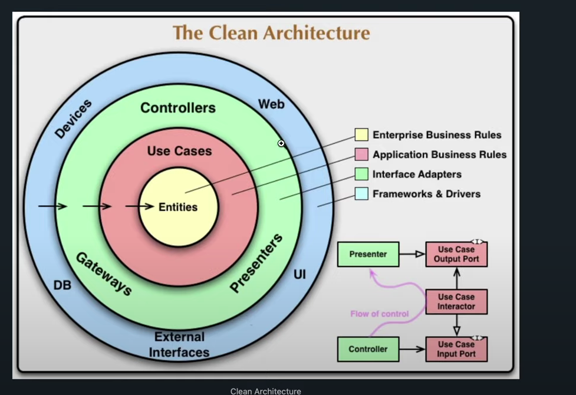

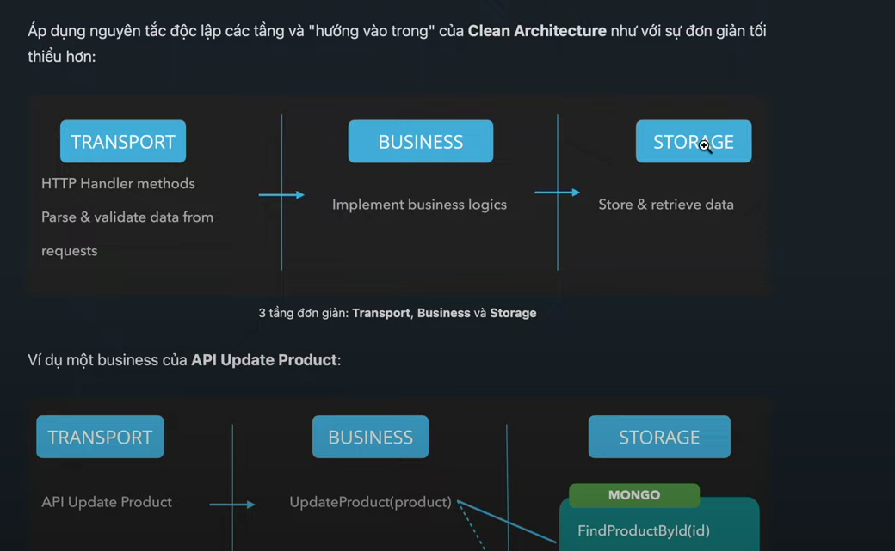


Error chưa custom

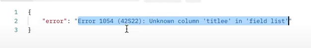

Bug ở đây
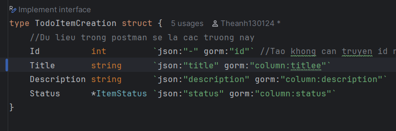

Custom lại Error ở đây (Vẫn giữ lại root err)

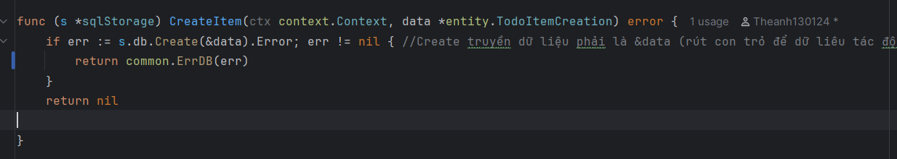

và bỏ gin.H đi 
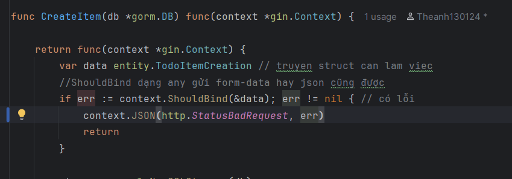

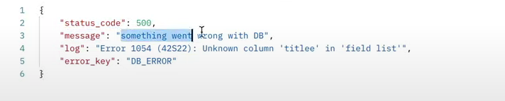

<h2>Panic , Recover , Defer </h2>
Panic và Recover (deffered functions -> hàm được khai báo không được chạy ngay(chạy sau cùng))
(nghĩa là hàm chạy xong rồi thoát ra mới chạy hàm defer)
-> recover ngược lại với defferered
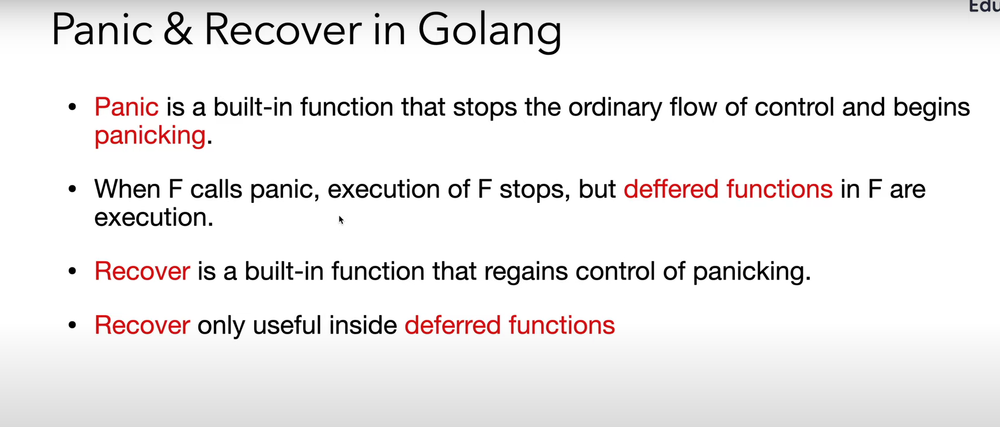

```
-panic dừng hàm foo() và chuyển về panicking (nên sẽ thoát ra và khi thoát ra sẽ chạy hàm defer bar()) 
-khi gặp recover lấy lại trạng thái khỏi panicking và chạy tiếp hàm bên foo()
```
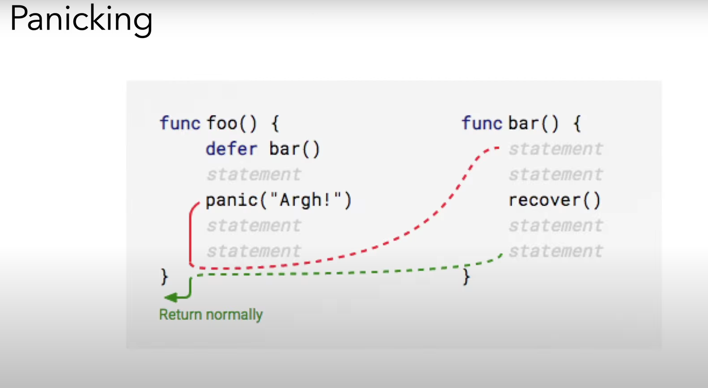

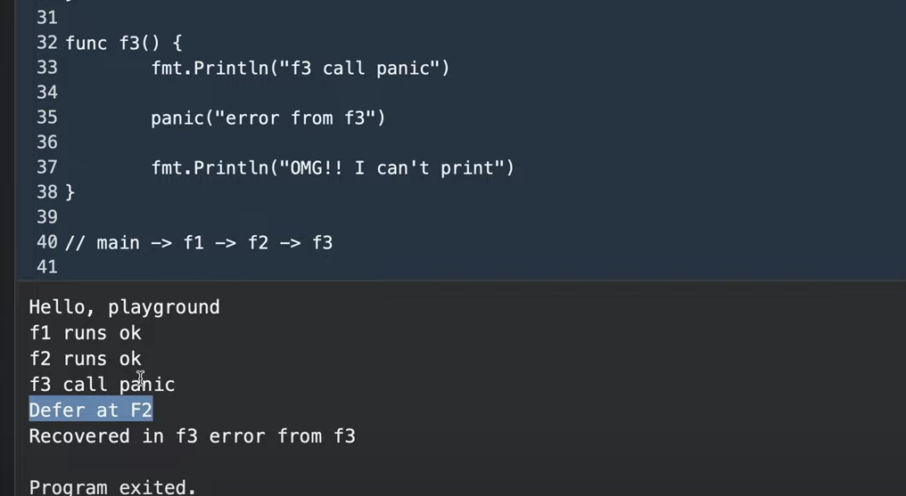


🧨 1. panic: Gây ra lỗi nghiêm trọng và dừng chương trình
```
panic được dùng khi chương trình gặp lỗi không thể xử lý tiếp, ví dụ như chia cho 0, không tìm thấy dữ liệu quan trọng,...

Khi panic được gọi:

Lập tức dừng hàm hiện tại.

Gọi các defer theo thứ tự LIFO (Last In First Out).

Sau đó tiếp tục truyền lỗi lên hàm gọi.

Nếu không có recover, chương trình sẽ crash.

Ví dụ:

func main() {
fmt.Println("Bắt đầu")
panic("Lỗi nghiêm trọng")
fmt.Println("Dòng này sẽ không chạy")
}
```

🛡 2. recover: Bắt lại panic để chương trình không bị crash
recover chỉ hoạt động bên trong một defer. Nếu có panic, bạn dùng recover() để bắt nó lại, tránh chương trình bị dừng đột ngột.
```
Ví dụ:

func main() {
defer func() {
if r := recover(); r != nil {
fmt.Println("Đã phục hồi sau panic:", r)
}
}()

    fmt.Println("Bắt đầu")
    panic("Lỗi nghiêm trọng")
    fmt.Println("Dòng này vẫn không chạy, nhưng chương trình không crash")
}
```
🧹 3. defer: Trì hoãn thực thi hàm đến cuối cùng trước khi thoát hàm
defer dùng để đảm bảo tài nguyên được đóng/gọn gàng ngay cả khi có lỗi xảy ra. Các defer sẽ chạy ngược thứ tự khai báo.
```
Ví dụ:

func test() {
defer fmt.Println("Dọn dẹp 1")
defer fmt.Println("Dọn dẹp 2")
fmt.Println("Thực thi chính")
}
```
Kết quả:


Thực thi chính
Dọn dẹp 2
Dọn dẹp 1


Gin midldleware
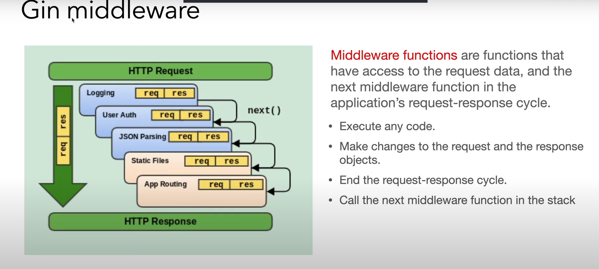
